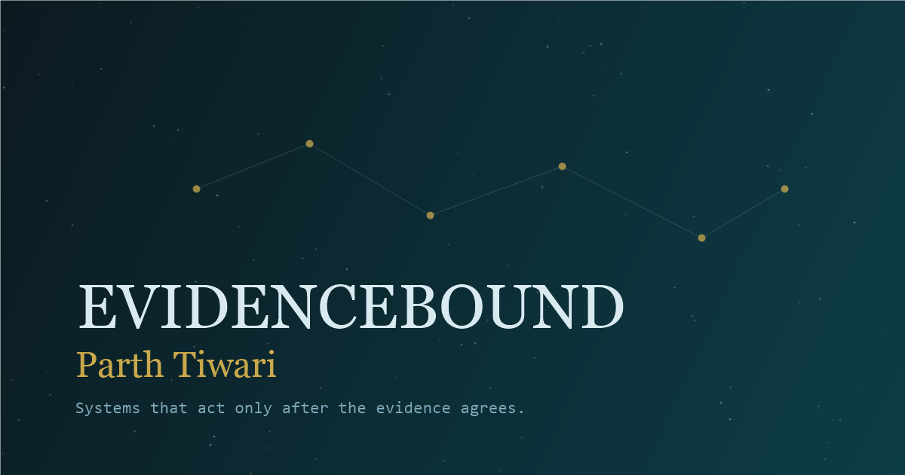

# EPHEMERIS

**A cinematic AI engineering portfolio for Parth Tiwari.**

EPHEMERIS is a single-page portfolio built around a living evidence constellation. An ephemeris is a table of computed positions of celestial bodies, and the name states the design rule: positions are derived from data, never placed by hand. Instead of presenting projects as a flat list, it turns each system into a node with its own problem, architecture, proof, boundaries, and launch links.

[Live Website](https://parth-tiwari-1.vercel.app/)



## Why This Exists

Most AI portfolios show a few cards, a resume, and a long list of tools. This one is built to make the work feel inspectable.

The site is designed around one principle:

> Systems should act only after the evidence, schema, budget, and workflow state agree.

That idea shows up in the interface itself. Projects are not just listed; they are explored as evidence objects. Each node opens into a film-strip style panel with:

- the problem the system is solving
- the architecture behind it
- the proof or evaluation signal
- the boundaries and refusal rules
- public links when they are safe to expose

The result is part portfolio, part interactive system map, and part proof archive.

## Highlights

- **Desktop constellation experience** with a WebGL starfield, scroll-driven camera motion, glowing project nodes, hover labels, and same-page project overlays.
- **Mobile-specific star world** built for portrait screens, with mobile project cards, drawer navigation, and the same evidence overlays reused from desktop.
- **Film-strip project overlays** for every system in `src/data/projects.ts`, including personal projects, work experience, current builds, and utility/tooling nodes.
- **Evidence overlays** for experience, training, capabilities, about, and resume.
- **Drive-backed resume renderer** so the resume can be updated through a Google Drive link instead of editing the site every time.
- **Conversion layer** with a ranked contact surface (booking, message form, email, WhatsApp), a three-offer services block, and a persistent booking action that is one tap from every screen.
- **Plain static fallback** at `/?plain=1` for print, low-power viewing, and crawlable content. It contains everything the full experience does, services and contact included.
- **Production SEO setup** with Open Graph, Twitter cards, canonical metadata, JSON-LD, robots, sitemap, and Vercel cache headers.

## Tech Stack


## Core Ideas

### Evidence Constellation

The primary desktop experience is a scrollable constellation of project nodes. Node size communicates evidence weight. Node color communicates project type:

- personal project
- work experience
- currently building
- utility / tooling

Clicking a node opens the project evidence overlay without leaving the page.

### Same-World Overlays

The site does not route users away to separate project pages. Project panels, training, capability, experience, about, and resume all open inside the same visual world. This keeps the portfolio feeling like one coherent interface instead of a collection of detached pages.

### Mobile Identity

Mobile does not try to force the desktop WebGL constellation into a cramped screen. It uses a dedicated animated star world and a card-based systems index while preserving the same visual language and project overlay content.

### Plain Mode

`/?plain=1` renders a complete static version of the portfolio with no 3D, no boot sequence, and no animation. It is useful for print, quick scanning, and low-power environments.

## Project Structure

```text
src/
  components/
    conversion/     Booking CTA, contact panel, services block
    evidence/       Evidence overlays: experience, training, capability, about, resume
    overlay/        Project film-strip overlay and panel views
    scene/          Desktop constellation, shaders, particles, nodes, labels
    sections/       Hero, top bar, mobile systems index, mobile footer, plain fallback
    shared/         Reusable UI primitives
  composables/      Interaction, animation, scroll, plain-mode, and body-lock helpers
  config/           Site URL, site name, booking and contact constants
  data/             Canonical project, training, capability, social, service, resume data
  shaders/          GLSL shaders for sky, particles, and ripple effects
  stores/           Pinia stores for projects, overlays, sliders, and evidence surfaces
  styles/           Tokens, typography, glass, cursor, and plain-mode styles
  types/            Project, node, and slider interfaces
```

## Local Setup

This project was bootstrapped as a Vite + Vue + TypeScript app and then locked around the 3D stack used by the portfolio. The current dependency setup is intentionally conservative:

- Three.js and TresJS are pinned because the constellation scene, shaders, and post-processing depend on their current behavior.
- Vite and TypeScript are on the newer clean-audit toolchain used by the production build.
- `package-lock.json` is committed, so installs should reproduce the same dependency graph.
- No environment variables are required for the current static version.

Install dependencies from the lockfile:

```bash
npm install
```

Start the dev server:

```bash
npm run dev
```

On Windows PowerShell, if `npm.ps1` is blocked by execution policy, use:

```bash
npm.cmd install
npm.cmd run dev
```

If dependency state ever gets strange locally, reset only the generated install artifacts and reinstall:

```bash
rm -rf node_modules
npm install
```

Windows PowerShell equivalent:

```powershell
Remove-Item -Recurse -Force node_modules
npm.cmd install
```

Do not casually upgrade `three` or `@tresjs/core`; treat those as visual/runtime dependencies and test the constellation carefully after any change.

## Quality Checks

```bash
npm run typecheck
npm run build
npm audit --audit-level=moderate
```

Windows PowerShell equivalent:

```bash
npm.cmd run typecheck
npm.cmd run build
npm.cmd audit --audit-level=moderate
```

Preview the production build:

```bash
npm run preview
```

## Deployment

The site is deployed on Vercel:

[https://parth-tiwari-1.vercel.app/](https://parth-tiwari-1.vercel.app/)

The app is fully static. No environment variables are required for the current version.

`vercel.json` handles:

- SPA rewrites to `index.html`
- immutable caching for built assets
- cache headers for public image/icon assets

## SEO And Crawl Support

The site URL and site name live in one place, `src/config/site.ts`. `index.html`
is static HTML served before any JS runs, so it cannot import that constant and
mirrors it instead — `src/config/site.ts` lists every line in `index.html` that has
to change alongside it, plus `public/sitemap.xml` and `public/robots.txt`.

The production alias is resolved from the Vercel project's `domains` array, never
guessed from the project name. `parth-tiwari.vercel.app` is a different owner's
site; ours is `parth-tiwari-1.vercel.app`.

Production metadata lives in `index.html`:

- title and description
- canonical URL
- Open Graph image
- Twitter summary card
- theme color
- JSON-LD for `Person`, `WebSite`, and `ProfilePage`

Public crawl files:

- `public/robots.txt`
- `public/sitemap.xml`

Static fallback:

- `/?plain=1`

## Updating Content

Most portfolio content is data-driven.

| Content | File |
|---|---|
| Site URL, site name, booking link, contact channels | `src/config/site.ts` |
| Services and offer copy | `src/data/services.ts` |
| Projects, panels, node metadata, links | `src/data/projects.ts` |
| Training records | `src/data/training.ts` |
| Capability groups | `src/data/capabilities.ts` |
| About copy | `src/data/about.ts` |
| Social links | `src/data/socialLinks.ts` |
| Resume Drive link | `src/data/resume.ts` |

Project links should only be added when they are public and safe to expose. Private repos, company endpoints, account data, credentials, and unreviewed deployment URLs should stay out of the portfolio. Vercel aliases are confirmed against the project's own `domains` array before they are linked, because short `*.vercel.app` names are claimed globally and may belong to someone else.

Testimonials, metrics, and client names are never written by hand. The testimonial slot renders nothing until a real, attributed quote exists.

## Browser Notes

Chrome is the target browser for the WebGL performance path. The desktop constellation uses a capped device pixel ratio to keep the experience smooth without flattening the visual identity.

Reduced-motion users skip or simplify motion-heavy experiences where possible.

## License

This is a personal portfolio project for Parth Tiwari. The code and content are not currently published under an open-source license.
